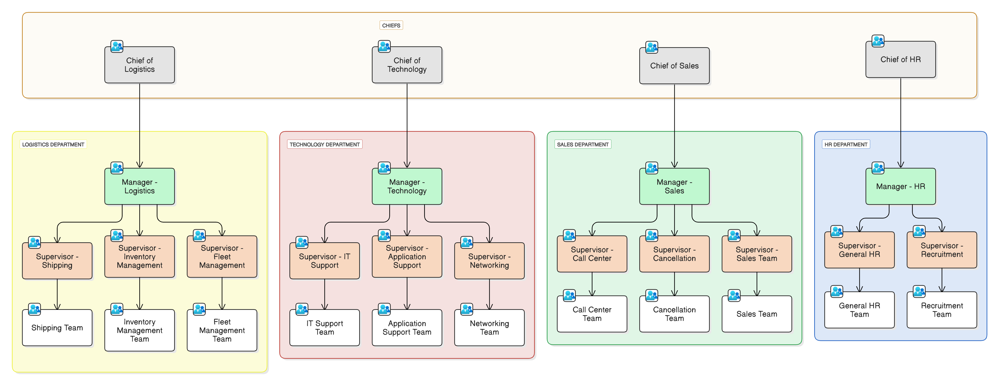
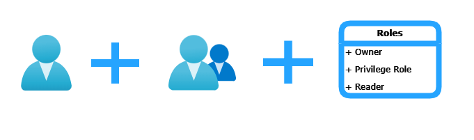
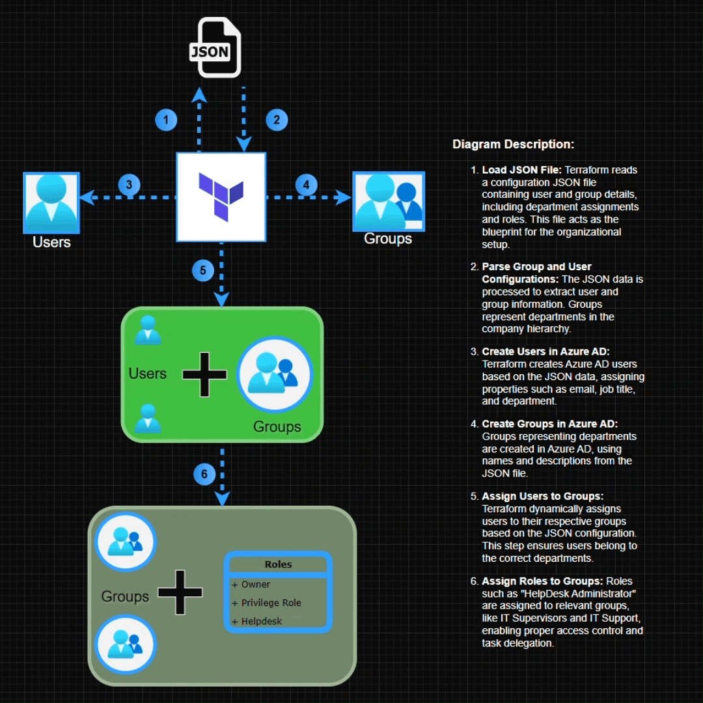

**Azure Lab Project Overview**

In this Azure lab project, I am focused on building a foundational organizational hierarchy using Azure Entra (formerly Azure Active Directory). My primary goal is to create a robust, secure, and scalable starting point that serves as the backbone for more advanced and complex configurations. By leveraging Terraform, a powerful infrastructure-as-code tool, I can automate the creation of network and infrastructure resources, ensuring consistency and efficiency. Terraform’s ability to define configurations as code allows for rapid scaling, seamless replication of environments, and easy adaptation to organizational changes. This makes it a cornerstone for constructing and iterating on secure, complex setups.

## Objectives for Stage 1


The **main objective** of this project is to establish a foundational Identity and Access Management (IAM) system using Azure Entra. Specifically, I set up users, groups, and roles in a JSON configuration file, and then used Terraform to read this file and automate the creation and assignment of these entities in my Azure account. This project emphasizes the following key tasks:

- Designing a clear organizational structure with users, groups, and roles.
    
- Automating the setup of these entities using Terraform and JSON integration.
    
- Establishing a scalable and repeatable foundation for further Azure configurations and enhancements.
    

These efforts provide a robust starting point for managing Azure resources while maintaining efficiency and consistency.

Establishing a reliable foundation ensures I can efficiently build, expand, and dismantle complex configurations as required, all while maintaining the integrity of core components such as users, groups, roles, policies, and MFA setups. This approach reduces errors, enhances flexibility, and supports the development of a secure, scalable Azure environment tailored to diverse organizational needs.


## Topology




---

This diagram shows the organizational structure of a example company, from top leadership to teams at the bottom. Here’s how it flows:

1. **Top Level: Chiefs**
    
    - Chiefs lead the company’s main departments:
        - **Logistics**, **Technology**, **Sales**, and **HR (Human Resources)**.
2. **Middle Level: Managers**
    
    - Each Chief has a Manager who oversees their department, ensuring smooth operations.
3. **Lower Level: Supervisors**
    
    - Managers delegate to Supervisors, each responsible for specific areas within the department.
        - Example: In Logistics, Supervisors handle Shipping, Inventory, and Fleet Management.
4. **Bottom Level: Teams**
    
    - Supervisors manage Teams, the employees handling day-to-day tasks.
        - Example: The Shipping Supervisor leads the Shipping Team.


## Foundation Using Terraform

To kickstart the lab, I used **Terraform** to automate the creation of **users, groups, and roles** based on the company’s hierarchical structure. This serves as the **backbone for a scalable and secure mock organization**. The setup enables me to:

- **Demonstrate how to scale an organization** by adding users, groups, and permissions.
    
- **Explore and implement Azure Entra’s IAM features** to secure resources.
    
- **Gain hands-on experience** by testing, troubleshooting, and iterating on configurations within the Azure environment.
    

Terraform has been invaluable in creating a **dynamic platform** for showcasing IAM concepts. It allows for **real-world scenarios** and flexible configurations, helping me deepen my understanding of Azure’s capabilities.

## **What is Terraform?**

**Terraform** is like a toolbox for automating IT infrastructure setup. Imagine building a house with pre-defined tools rather than manually assembling everything—Terraform provides that **efficiency for IT environments**. It automates tasks such as setting up servers, creating user accounts, and managing cloud resources.

With Terraform, I can define configurations using templates, ensuring a **consistent and reliable setup**. Here are a few reasons why Terraform stands out:

- **Time-Saving:** Automates repetitive tasks, reducing manual effort.
    
- **Cross-Platform Integration:** Works not only with Azure but also with AWS, Google Cloud, and others.
    
- **Version Control:** Tracks all changes, making it easy to update or revert configurations.
    
- **Open-Source:** Continuously improved by a global developer community.
    

For example, I’ve used Terraform to set up **Azure AD users, groups, and permissions** with just a few lines of configuration. If there’s an issue, I can adjust and reapply changes swiftly.
    


                                  


## Stage Initial Terraform Code 

```
terraform {
  required_providers {
    azuread = {
      source  = "hashicorp/azuread"
      version = "~> 2.0"
    }
    azurerm = {
      source  = "hashicorp/azurerm"
      version = "~> 3.0"
    }
  }

  backend "local" {
    path = "terraform.tfstate" # Use a local file to store Terraform state
  }

  required_version = ">= 1.3.0" # Ensure compatibility with Terraform versions 1.3.0 and above
}

provider "azuread" {
  # Provider for managing Azure Active Directory resources
}

provider "azurerm" {
  features {} # Enable all necessary features for Azure Resource Manager
  subscription_id = var.subscription_id # Use the subscription ID defined in variables
}

variable "resource_group_name" {
  description = "Name of the Azure Resource Group"
  type        = string
  default     = "Cyber-Corp-Test-ResourceGroup" # Default resource group name
}

variable "environment" {
  description = "Deployment environment"
  type        = string
  default     = "Test" # Default environment tag
}

variable "project_name" {
  description = "Project name"
  type        = string
  default     = "Cyber Corp Lab" # Default project name tag
}

variable "config_file" {
  description = "Path to the configuration JSON file"
  type        = string
  default     = "config.json" # Specify the default path to the config file

  validation {
    condition     = can(jsondecode(file(var.config_file))) # Ensure the file is valid JSON
    error_message = "Configuration file missing or invalid. Please check config.json." # Error message if validation fails
  }
}

locals {
  config = try(jsondecode(file(var.config_file)), {}) # Load and parse the config.json file, default to an empty object if missing

  users           = lookup(local.config, "users", []) # Extract users from the configuration
  groups          = lookup(local.config, "groups", {}) # Extract groups from the configuration
  memberships     = flatten([
    for group, members in lookup(local.config, "memberships", {}) : [
      for member in members : {
        group  = group, # Group name
        member = member # Member email
      }
    ]
  ])
  role_assignments = lookup(local.config, "role_assignments", []) # Extract role assignments from the configuration
}

resource "azurerm_resource_group" "rg" {
  name     = var.resource_group_name # Name of the resource group
  location = var.location # Location of the resource group, defined elsewhere

  tags = {
    Environment = var.environment # Add environment tag
    Project     = var.project_name # Add project tag
  }
}

resource "random_password" "user_password" {
  for_each = { for user in local.users : user.email => user } # Generate a unique password for each user
  length   = 16 # Password length
  special  = true # Include special characters in the password
}

resource "azuread_user" "users" {
  for_each = { for user in local.users : user.email => user } # Create a resource for each user in the config

  user_principal_name   = each.value.email # Set the email as the principal name
  display_name          = each.value.name # User's display name
  mail_nickname         = lower(replace(each.value.name, " ", "")) # Generate a mail nickname by removing spaces
  mail                  = each.value.email # User's email address
  password              = random_password.user_password[each.key].result # Assign the generated password
  force_password_change = true # Require the user to change their password on first login
  department            = lookup(each.value, "department", null) # Assign department if specified
  job_title             = lookup(each.value, "jobTitle", null) # Assign job title if specified
}

resource "azuread_group" "groups" {
  for_each = local.groups # Create a resource for each group in the config

  display_name       = each.value.displayName # Group's display name
  mail_nickname      = lower(replace(each.value.displayName, " ", "")) # Generate a mail nickname by removing spaces
  security_enabled   = lookup(each.value, "security_enabled", true) # Enable security for the group by default
  assignable_to_role = lookup(each.value, "assignable_to_role", true) # Allow the group to be assigned roles if specified
}

resource "azuread_group_member" "group_members" {
  for_each = { for pair in local.memberships : "${pair.group}-${pair.member}" => pair } # Add members to groups based on config

  group_object_id  = azuread_group.groups[each.value.group].id # Group's object ID
  member_object_id = azuread_user.users[each.value.member].id # Member's object ID
}

resource "azuread_directory_role_assignment" "role_assignments" {
  for_each = { for assignment in local.role_assignments : "${assignment.group}-${assignment.role_id}" => assignment } # Assign roles based on config

  role_id             = each.value.role_id # Role ID to assign
  principal_object_id = azuread_group.groups[each.value.group].id # Group's object ID to assign the role to
}

output "resource_group_name" {
  description = "The name of the Azure Resource Group."
  value       = azurerm_resource_group.rg.name # Output the name of the resource group
}

output "user_principal_names" {
  description = "List of user principal names."
  value       = [for user in azuread_user.users : user.user_principal_name] # Output all user principal names
}

output "group_object_ids" {
  description = "Mapping of group names to their object IDs."
  value       = { for group_name, group in azuread_group.groups : group_name => group.id } # Output mapping of group names to IDs
}

output "group_memberships" {
  description = "Mapping of groups to their members."
  value       = {
    for group, members in local.memberships : group => [for member in members : member] # Output group memberships
  }
}

output "role_assignments" {
  description = "Mapping of role IDs to principal object IDs."
  value       = {
    for role_id in distinct([for ra in azuread_directory_role_assignment.role_assignments : ra.role_id]) : 
    role_id => [
      for ra in azuread_directory_role_assignment.role_assignments : 
      ra.principal_object_id if ra.role_id == role_id # Output role assignments
    ]
  }
}

output "subscription_id" {
  description = "Azure subscription ID."
  value       = var.subscription_id # Output the subscription ID
}


```


!


### **Stage Initial Purpose**

This stage focuses on building a foundational Identity and Access Management (IAM) environment designed to replicate a real-world corporate structure, ensuring that the setup closely mirrors the access and organizational needs of a typical business. This approach highlights practical relevance, enabling seamless integration of users, groups, and roles into scalable workflows. The goal is to automate the creation of Azure Active Directory users, groups, and role assignments by leveraging Terraform scripts that read from a JSON file. This combination ensures efficiency by standardizing configurations and enables consistency across deployments, making the setup highly repeatable and adaptable to changes. This approach ensures a secure, organized, and efficient setup for managing access to Azure resources. It also streamlines processes to support scalability and adaptability, enabling seamless integration with future enhancements.




---

### **Key Features**

#### **Resource Group Setup:**

I created a dedicated **Azure Resource Group**, tagged for easy identification (“Test” environment, “Steel Corp Lab” project). This acts as a logical container for organizing resources.

#### **Dynamic User and Group Management:**

- **Users:** Created Azure AD users dynamically based on a configuration file (“config.json”) with details like names, emails, and roles.
    
- **Groups:** Established **security-enabled groups** to align with the company’s hierarchy, such as “IT Support,” “Sales Team,” and “Executives.”
    

#### **Group Memberships:**

Users are assigned to appropriate groups automatically, ensuring a **structured and scalable permission setup**. For instance, Sales Managers belong to the “Managers - Sales” group. By leveraging dynamic user assignments, I’ve made the setup adaptable to organizational changes, such as promotions or team reassignments.

#### **Role-Based Access Control (RBAC):**

- Assigned roles such as  "Helpdesk Administrator" to IT Support and Supervisors of IT, ensuring precise access levels.
    

#### **Secure Credentials:**

Generated **secure, random passwords** for all users, enforcing password resets upon first login to comply with **best practices**.


## Users info
I created a JSON file with 38 users, assigning each user an Azure AD email, job title, department, and team. For example:

```
{
  "users": [
    { "name": "Alice Brown", "email": "alice.brown@cyberspacecorp.onmicrosoft.com", "team": "Call Center", "jobTitle": "Representative", "department": "Call Center" },
    { "name": "Bob Green", "email": "bob.green@cyberspacecorp.onmicrosoft.com", "team": "Supervisor - Shipping", "jobTitle": "Supervisor", "department": "Logistics" },
    { "name": "Charlie White", "email": "charlie.white@cyberspacecorp.onmicrosoft.com", "team": "Call Center", "jobTitle": "Representative", "department": "Call Center" },
    { "name": "Daisy Black", "email": "daisy.black@cyberspacecorp.onmicrosoft.com", "team": "Cancellation", "jobTitle": "Cancellation Specialist", "department": "Cancellation" },
    { "name": "Edward Yellow", "email": "edward.yellow@cyberspacecorp.onmicrosoft.com", "team": "Cancellation", "jobTitle": "Cancellation Specialist", "department": "Cancellation" },
    { "name": "Fiona Red", "email": "fiona.red@cyberspacecorp.onmicrosoft.com", "team": "Sales", "jobTitle": "Salesperson", "department": "Sales" }
  ]
}
```

Organizing users in this way is incredibly helpful for setting up **Role-Based Access Control (RBAC)** and **dynamic grouping** later on. It ensures that user roles and permissions are aligned with their job responsibilities, making it easy to adjust access when someone changes roles or leaves the company.

To further enhance the organizational structure, I created 30 groups to represent the departments in the hierarchy. These groups include key roles and team-based classifications such as:

```
{
  "groups": {
    "call_center": { "displayName": "Call Center Team" },
    "cancellation": { "displayName": "Cancellation Team" },
    "sales": { "displayName": "Sales Team" },
    "manager_sales": { "displayName": "Manager - Sales" },
    "supervisor_call_center": { "displayName": "Supervisor - Call Center" },
    "it_support": { "displayName": "IT Support Team" },
    "application_support": { "displayName": "Application Support Team" },
    "networking": { "displayName": "Networking Team" },
    "shipping": { "displayName": "Shipping Team" },
    "inventory_management": { "displayName": "Inventory Management Team" },
    "fleet_management": { "displayName": "Fleet Management Team" },
    "chief_technology": { "displayName": "Chief of Technology" },
    "chief_sales": { "displayName": "Chief of Sales" }
  }
}
```

This setup simplifies managing access and permissions by aligning users with their respective departments and roles. Groups provide a centralized way to assign and modify access, ensuring that organizational changes—such as promotions or team transfers—are seamless and secure.

To further organize the structure, I assigned each user to their respective groups as members. For example:

```
{
  "memberships": {
    "call_center": [
      "alice.brown@cyberspacecorp.onmicrosoft.com",
      "bob.green@cyberspacecorp.onmicrosoft.com",
      "charlie.white@cyberspacecorp.onmicrosoft.com",
      "olivia.black@cyberspacecorp.onmicrosoft.com",
      "amelia.white@cyberspacecorp.onmicrosoft.com"
    ],
    "cancellation": [
      "daisy.black@cyberspacecorp.onmicrosoft.com",
      "edward.yellow@cyberspacecorp.onmicrosoft.com",
      "mason.yellow@cyberspacecorp.onmicrosoft.com"
    ]
  }
}
```

This step ensures that users are automatically grouped based on their job title, team, and department. It also simplifies permission management and enhances scalability.

Finally, I assigned roles to some of the groups, enabling precise access control through RBAC. For instance:

```
{
  "role_assignments": [
    { "role_id": "fdd7a751-b60b-444a-984c-02652fe8fa1c", "group": "chief_hr", "scope": "resource_group" },
    { "role_id": "729827e3-9c14-49f7-bb1b-9608f156bbb8", "group": "it_support", "scope": "resource_group" },
    { "role_id": "d37c8bed-0711-4417-ba38-b4abe66ce4c2", "group": "networking", "scope": "resource_group" },
    { "role_id": "729827e3-9c14-49f7-bb1b-9608f156bbb8", "group": "supervisor_it_support", "scope": "resource_group" },
    { "role_id": "9b895d92-2cd3-44c7-9d02-a6ac2d5ea5c3", "group": "supervisor_application_support", "scope": "resource_group" }
  ]
}
```

By assigning roles to specific groups, this makes it easy to manage permissions at scale and ensures security best practices are followed.

I intentionally left out the roles for **Chiefs** and **Managers of Technology** in this section because they hold higher-level permissions that require additional security measures. These include Just-In-Time (JIT) access, multi-factor authentication (MFA) for activation, and approval workflows to ensure that access to sensitive resources is tightly controlled and used only when necessary. These roles will be introduced and detailed in the **PIM (Privileged Identity Management)** section, where I will explain how Just-In-Time access, approval workflows, and MFA activation are implemented to secure and manage their elevated permissions effectively.
# Terminal to Azure Account

My terminal is connected to Azure using the Azure CLI. This connection allows Terraform to securely interact with Azure services, including Azure Active Directory and Azure Resource Manager. By authenticating through the CLI, Terraform can access my subscription and manage resources like users, groups, and infrastructure seamlessly. This setup ensures all actions are securely linked to my Azure account without requiring manual intervention for every command.

```
CYBER@CYBERSPACE:~/IAM_Labs/Stage-Initial$ az login
```
This command up bring up a Microsoft login window to enter my credential. 


Running `terraform init` is the first step to prepare Terraform for managing my Azure resources. It sets up the **backend**, where Terraform stores its state, and downloads the **provider plugins** needed to connect to Azure. For this project, it uses the `azuread` plugin to manage users and groups, the `azurerm` plugin for infrastructure like resource groups, and the `random` plugin to create secure passwords.

When Terraform says 'Terraform has been successfully initialized!', it means everything is ready to start building and managing resources in Azure

```
CYBERSPACE@CYBERSPACE:~/IAM_Labs/Stage-Initial$ terraform init
Initializing the backend...
Initializing provider plugins...
- Reusing previous version of hashicorp/azuread from the dependency lock file
- Reusing previous version of hashicorp/azurerm from the dependency lock file
- Reusing previous version of hashicorp/random from the dependency lock file
- Using previously-installed hashicorp/azuread v3.0.2
- Using previously-installed hashicorp/azurerm v4.13.0
- Using previously-installed hashicorp/random v3.6.3

Terraform has been successfully initialized!
```

Running `terraform validate` ensures my Terraform configuration files are error-free and properly structured before moving forward. This step acts as a quick quality check to catch mistakes like typos or misconfigured variables, ensuring my setup is ready for the next stage.
```
CYBER@CYBERSPACE:~/IAM_Labs/Stage-Initial$ terraform validate
Success! The configuration is valid.
```

When I run `terraform plan -out=tfplan`, it not only previews the changes Terraform will make but also saves those changes in a file for later use. This ensures that the exact plan I reviewed and approved is the one applied to Azure. It's a critical step for maintaining consistency, especially in larger teams or automated workflows, where precision and predictability are key.

```
CYBER@CYBERSPACE:~/IAM_Labs/Stage-Initial$ terraform plan -out=tfplan
```

Running `terraform apply tfplan` takes the exact changes I planned earlier and applies them to Azure. This ensures that the approved configuration is implemented without unexpected modifications, maintaining consistency and reducing risk. It's especially useful in workflows where precision and predictability are essential, like in team environments or automated deployments.


## Output 

```
random_password.user_password["wendy.quartz@cyberopspace.onmicrosoft.com"]: Creating...
random_password.user_password["alice.brown@cyberopspace.onmicrosoft.com"]: Creation complete after 0s [id=none]
random_password.user_password["ursula.emerald@cyberopspace.onmicrosoft.com"]: Creation complete after 0s [id=none]
random_password.user_password["xander.marble@cyberopspace.onmicrosoft.com"]: Creating...
random_password.user_password["mike.silver@cyberopspace.onmicrosoft.com"]: Creation complete after 0s [id=none]
random_password.user_password["abby.amber@cyberopspace.onmicrosoft.com"]: Creating...
random_password.user_password["kyle.pink@cyberopspace.onmicrosoft.com"]: Creation complete after 0s [id=none]
random_password.user_password["edward.yellow@cyberopspace.onmicrosoft.com"]: Creating...
random_password.user_password["fiona.red@cyberopspace.onmicrosoft.com"]: Creating...
random_password.user_password["bob.green@cyberopspace.onmicrosoft.com"]: Creating...
random_password.user_password["victor.onyx@cyberopspace.onmicrosoft.com"]: Creation complete after 0s [id=none]
random_password.user_password["jane.gray@cyberopspace.onmicrosoft.com"]: Creation complete after 0s [id=none]
random_password.user_password["wendy.quartz@cyberopspace.onmicrosoft.com"]: Creation complete after 0s [id=none]
random_password.user_password["xander.marble@cyberopspace.onmicrosoft.com"]: Creation complete after 0s [id=none]
random_password.user_password["abby.amber@cyberopspace.onmicrosoft.com"]: Creation complete after 0s [id=none]
random_password.user_password["edward.yellow@cyberopspace.onmicrosoft.com"]: Creation complete after 0s [id=none]
random_password.user_password["fiona.red@cyberopspace.onmicrosoft.com"]: Creation complete after 0s [id=none]
random_password.user_password["bob.green@cyberopspace.onmicrosoft.com"]: Creation complete after 0s [id=none]
azuread_group.groups["managers_call_center"]: Creating...
azuread_user.users["daisy.black@cyberopspace.onmicrosoft.com"]: Creating...
azuread_group.groups["shipping"]: Creating...
azuread_user.users["wendy.quartz@cyberopspace.onmicrosoft.com"]: Creating...
azuread_group.groups["department_managers"]: Creating...
azuread_group.groups["supervisors_call_center"]: Creating...
azuread_group.groups["call_center"]: Creating...
azuread_group.groups["inventory_management"]: Creating...
azuread_group.groups["chief_hr"]: Creating...
azuread_user.users["mike.silver@cyberopspace.onmicrosoft.com"]: Creating...
```




## Verify in Azure

After running `terraform apply tfplan`, I verified that the configuration was successfully applied by checking the Azure portal. Navigating to the **Users** section in Azure Active Directory, I confirmed that the users defined in my Terraform configuration were created correctly. Each user's display name, user principal name, and membership details matched the specifications in my setup. This step is crucial as it ensures that Terraform has executed the desired changes accurately and aligns with the intended design of the environment

### Users 


### Groups


### Role Assign


## End of Initial Stage

This initial stage of the project establishes a strong foundation for managing users, groups, and roles within Azure. It demonstrates how Terraform can automate and streamline Identity and Access Management tasks while ensuring accuracy and scalability. By verifying the setup in the Azure platform, I confirmed that everything was implemented correctly, providing a reliable starting point for future enhancements.


